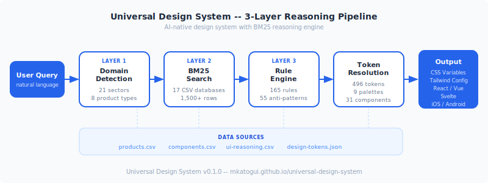
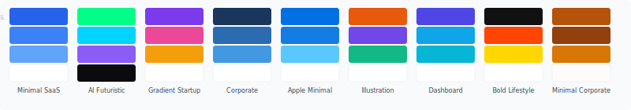

# Universal Design System

> The first AI-native design system. Describe your product — get a complete, accessible, shipping-ready design system in seconds.

[](https://www.npmjs.com/package/@mkatogui/universal-design-system)
[](https://mkatogui.github.io/universal-design-system/)
[](LICENSE)
[](#9-palettes)
[](#43-components)
[](#token-architecture)
[](#supported-platforms)
[]()

[Live Demo](https://mkatogui.github.io/universal-design-system/) · [Documentation](https://mkatogui.github.io/universal-design-system/docs.html) · [Component Library](https://mkatogui.github.io/universal-design-system/component-library.html) · [Token Reference](https://mkatogui.github.io/universal-design-system/reference.html)

---

## Why Universal Design System?

Most design systems give you components. We give AI a **deterministic recommendation engine** that understands your domain and makes design decisions for you.

```bash
python3 src/scripts/design_system.py "fintech dashboard"
# => palette: corporate, components: data-table, tabs, badge, side-nav
#    anti-patterns: playful-animations (CRITICAL), neon-colors (CRITICAL)
#    tokens: 4px radius, subtle shadows, Inter font, minimal motion
```

One command. Full design system. WCAG-validated. Domain-appropriate.

### How it compares

| Feature | UDS | Material UI | DaisyUI | Style Dictionary | Radix UI |
|---------|-----|-------------|---------|-----------------|----------|
| Deterministic recommendation engine | Yes | No | No | No | No |
| Domain-aware recommendations | 55 sectors, 21 product types | Manual selection | Manual selection | N/A | N/A |
| WCAG 2.2 AA automated audit | Automated contrast validation (108 pairs) | Partial | No | No | Yes (runtime) |
| Anti-pattern detection | 84 domain-specific rules | No | No | No | No |
| Multi-framework output | React, Vue, Svelte | React only | CSS only | Platform tokens | React only |
| AI platform support | 20 platforms | N/A | N/A | N/A | N/A |
| Design tokens (W3C DTCG) | ~600 tokens | Custom format | CSS vars | Yes (tooling) | CSS vars |
| Zero-config palette system | 9 palettes + custom | Theming API | 30+ themes | N/A | N/A |
| BM25 search across 20 databases | Yes (1,676+ rows) | No | No | No | No |
| Tailwind CSS generation | Built-in | Community | Built-in | Plugin | No |

---

## Architecture



```
User Query -> Domain Detection -> BM25 Search -> Rule Application -> Output
               (55 sectors,        (20 CSVs,       (190 rules,
                21 product types)   1,676+ rows)     84 anti-patterns)
```

**Layer 1 -- Domain Detection:** Classifies your product across 55 industry sectors and 21 product types with confidence scores.

**Layer 2 -- BM25 Search:** Okapi BM25 ranking (k1=1.5, b=0.75) with Porter stemmer and synonym expansion across 20 CSV databases. Surfaces the most relevant palettes, components, patterns, typography, and color schemes.

**Layer 3 -- Rule Application:** Evaluates 190 conditional rules and flags 84 industry-specific anti-patterns. First match wins for palette; all matching rules accumulate.

### Ecosystem and token pipeline

UDS is the **inference layer**: it infers design decisions (palette, components, anti-patterns) from your query. The rest of the pipeline is optional and tool-agnostic:

- **Tokens:** UDS uses `tokens/design-tokens.json` as the source of truth. **Style Dictionary** (already integrated via `npm run build`) compiles tokens to CSS, JS, iOS Swift, and Android XML. No extra setup required.
- **Optional tooling:** You can combine UDS with [Tokens Studio](https://tokens.studio/) (Figma ↔ Git sync), [Specify](https://specifyapp.com/) (enterprise token lifecycle), [Storybook](https://storybook.js.org/) (component testing and docs), or [Zeroheight](https://zeroheight.com/) (design system documentation). UDS does not depend on them; it only produces the spec and tokens. Use these tools to govern, test, or document the system after generation.
- **Reference systems:** UDS is informed by lessons from Material Design, Polaris, and Primer (see [SPECIFICATION.md](SPECIFICATION.md) §0.7). Future directions (analytics, multi-agent orchestration, visual token interaction) are noted in §0.8.

---

## Quick Start

### For a React app (recommended path)

1. **Install:** `npm install @mkatogui/uds-react react react-dom`
2. **Set theme:** Put `data-theme="minimal-saas"` (or another palette) on `<html>` in your root HTML or layout, e.g. `<html lang="en" data-theme="minimal-saas">`.
3. **Import styles first:** In your app entry (e.g. `main.tsx`), add `import '@mkatogui/uds-react/styles.css'` before other imports.
4. **Use components:** Wrap layout in `<Container size="lg">` if desired, then use `<Button>`, `<Card>`, `<Input>`, etc. from `@mkatogui/uds-react`.

See [Install React components](#install-react-components) below for a full code snippet, or [examples/minimal-react](examples/minimal-react) for a minimal playground-style app.

### Install on any AI coding platform

```bash
npx @mkatogui/universal-design-system install
# Auto-detects: Claude Code, Cursor, Windsurf, VS Code, Zed, and 15 more
```

### Use the recommendation engine

```bash
# Search across all 20 databases
python3 src/scripts/search.py "fintech dashboard"

# Generate a full design system specification
python3 src/scripts/design_system.py "saas landing page"

# Generate with Tailwind CSS config
python3 src/scripts/design_system.py "healthcare portal" --format tailwind

# Generate with framework components
python3 src/scripts/design_system.py "ecommerce store" --framework react
python3 src/scripts/design_system.py "education app" --framework vue
python3 src/scripts/design_system.py "fintech dashboard" --framework svelte

# Persist design system to files for reuse by AI and humans (design-system/MASTER.md, optional design-system/pages/<name>.md)
python3 src/scripts/design_system.py "saas landing" --persist
python3 src/scripts/design_system.py "saas dashboard" --persist --page dashboard
```

### Apply a palette

**Required:** set `data-theme` on `<html>` (or your root app wrapper) for correct theming. Example:

```html
<html lang="en" data-theme="minimal-saas">
```

```js
// Switch at runtime
document.documentElement.setAttribute('data-theme', 'ai-futuristic');
```

### Use tokens in your CSS

```css
.my-card {
  background: var(--color-bg-surface);
  border: 1px solid var(--color-border);
  border-radius: var(--radius);
  padding: var(--space-4);
  box-shadow: var(--shadow-sm);
}
```

### Install standalone tokens

```bash
npm install @mkatogui/uds-tokens
```

```js
import '@mkatogui/uds-tokens/css';           // CSS custom properties
import { tokens } from '@mkatogui/uds-tokens'; // JS/TS object
```

### Install React components

```bash
npm install @mkatogui/uds-react react react-dom
```

Import UDS styles once at your app entry: `import '@mkatogui/uds-react/styles.css'`. Then:

```tsx
import { Button, Card } from "@mkatogui/uds-react";
import "@mkatogui/uds-react/styles.css";

// Set palette (e.g. in root layout or index.html)
document.documentElement.setAttribute("data-theme", "minimal-saas");

<Button variant="primary">Get Started</Button>
```

See [examples/react-app](https://github.com/mkatogui/universal-design-system/tree/main/examples/react-app) for a full demo with palette switching and dark mode, or [examples/minimal-react](examples/minimal-react) for a minimal playground-style starter (Container + Card + Button in 3 files).

When using the React package, components use the `uds-*` BEM prefix (e.g. `.uds-btn`, `.uds-card`, `.uds-input`). The [Component Library](https://mkatogui.github.io/universal-design-system/component-library.html) documents both short and `uds-*` class names.

**Frontend integration notes:**

- **PowerShell (Windows):** `&&` is not valid in older PowerShell. Use `;` to chain commands, e.g.  
  `cd "C:\path\to\frontend"; npm install @mkatogui/uds-react @mkatogui/uds-tokens --save`
- **ESLint:** Import only the components you use to avoid `@typescript-eslint/no-unused-vars` (e.g. use `Card`, `CardTitle`, `CardContent`, `CardFooter` and omit `CardHeader` if you don’t render it).

---

## Published packages

| Package | Use when |
|---------|----------|
| `@mkatogui/universal-design-system` | CLI (`uds`), source tokens (JSON), Python scripts, docs, CSV data, MCP server, AI skills |
| `@mkatogui/uds-react` | React apps — 43 accessible components + tokens + styles |
| `@mkatogui/uds-tokens` | Design tokens only (CSS, JS, JSON) — no framework |

The main package ships **source** tokens (JSON) and tooling; for **built** CSS/JS/TS tokens use `@mkatogui/uds-tokens`. Vue, Svelte, and primitives packages live in the repo; publish status may vary. Prefer the main package for tooling and `uds-react` / `uds-tokens` for app integration.

---

## What You Get

Describe your product in plain English. The engine searches across 20 databases and 1,600+ data rows:

```
$ python3 src/scripts/design_system.py "fintech dashboard"

========================================
  DESIGN SYSTEM SPECIFICATION
  Query: fintech dashboard
  Palette: corporate
========================================

  COLOR TOKENS
  ----------------------------------------
  --color-brand:       #1E40AF
  --color-brand-hover: #1E3A8A
  --color-bg-primary:  #FFFFFF
  --color-bg-surface:  #F8FAFC
  --color-text:        #0F172A
  --color-border:      #E2E8F0

  COMPONENTS
  ----------------------------------------
  data-table    Sortable rows, sticky headers
  tabs          Section switching, active state
  badge         Status indicators (success/warning/error)
  side-nav      Collapsible navigation, active highlight
  stat          KPI display with trend arrows

  ANTI-PATTERNS
  ----------------------------------------
  [CRITICAL] playful-animations -- Finance users expect stability
  [CRITICAL] neon-colors -- Undermines trust in regulated sectors
  [HIGH]     dark-themes -- Reduces data readability in dashboards

  DESIGN RULES
  ----------------------------------------
  * Use 4px border-radius (corporate precision)
  * Subtle shadows only (no dramatic elevation)
  * Inter for body, Inter for display headings
  * Minimal motion -- transitions under 200ms
========================================
```

---

## 9 Palettes



Each palette controls color, shadow, border-radius, and display font. Foundation tokens (spacing, type scale, motion, z-index) stay locked across all palettes.

| Palette | Radius | Shadow | Display Font | Best For |
|---------|--------|--------|-------------|----------|
| `minimal-saas` | 8px | subtle | Inter | SaaS, productivity tools |
| `ai-futuristic` | 12px | glow | Space Grotesk | AI products, dev tools |
| `gradient-startup` | 16px | medium | Plus Jakarta Sans | Startups, MVPs |
| `corporate` | 4px | subtle | Inter | Enterprise, B2B, regulated |
| `apple-minimal` | 12px | diffused | SF Pro Display | Premium, luxury brands |
| `illustration` | 20px | playful | Nunito | Education, kids, creative |
| `dashboard` | 8px | subtle | Inter | Analytics, admin panels |
| `bold-lifestyle` | 0px | hard | Clash Display | Fashion, media, lifestyle |
| `minimal-corporate` | 6px | subtle | DM Sans | Legal, consulting, professional |

### Custom Palettes

Create palettes from your brand colors:

```bash
python3 src/scripts/palette.py create --name my-brand --colors "#8B5CF6"
python3 src/scripts/palette.py create --name duo-tone --colors "#E8590C,#7048E8" --shape round
python3 src/scripts/palette.py preview --colors "#8B5CF6"
python3 src/scripts/palette.py list
```

---

## 43 Components

All components use BEM naming (`.uds-{component}--{variant}`) and CSS custom properties. No hardcoded values.

| Category | Components |
|----------|-----------|
| **Navigation** | Button, Navbar, Sidebar, Tabs, Breadcrumb, Pagination |
| **Data Input** | Input, Select, Checkbox, Radio, Toggle, Date Picker, File Upload |
| **Data Display** | Card, Table, Badge, Avatar, Tooltip, Stat, Skeleton |
| **Feedback** | Alert, Toast, Modal, Progress, Command Palette |
| **Layout** | Hero, Accordion, Divider, Footer, Dropdown Menu |
| **Composite** | Pricing, Testimonial, Feature Card, Code Block |

```html
<button class="uds-btn uds-btn--primary uds-btn--md">Get Started</button>

<div class="uds-card">
  <h3 class="uds-card__title">Feature</h3>
  <p class="uds-card__body">Description using design tokens.</p>
</div>
```

---

## Token Architecture

~600 W3C DTCG tokens across 3 tiers:

```
Primitive (raw values)  ->  Semantic (functional names)  ->  Palette Overrides (per-palette)
  color.blue.700              color.brand                      corporate.color.brand
  space.4                     space.md                         (locked across palettes)
```

**Foundation tokens (locked):** body typography (Inter), 12-step spacing scale (4px base), motion durations/easing, z-index layers, opacity.

**Palette tokens (vary):** color (brand, text, bg, border, status), shadow (elevation), border-radius (shape), display font (h1-h3 only).

**Dark mode:** CSS variable override — same `--color-*` tokens redefined under `[data-theme="X"].docs-dark`.

---

## Supported Platforms

Install on any AI coding platform with one command:

```bash
npx @mkatogui/universal-design-system install --platform <name>
```

| | | | |
|----------|----------|----------|----------|
| Claude Code | Cursor | Windsurf | VS Code (Copilot) |
| Zed | Aider | Cline | Continue |
| Bolt | Lovable | Replit | OpenAI Codex |
| Kiro | Gemini CLI | Qoder | Roo Code |
| Trae | OpenCode | GitHub Copilot | Droid |

---

## CLI Commands

```bash
uds install              # Auto-detect platform and install
uds install --platform X # Install for a specific platform
uds install --dry-run    # Preview without changes
uds init                 # Interactive setup wizard
uds search "query"       # Search all databases
uds search "query" -v    # Verbose output
uds search "query" -j    # JSON output
uds generate "query"     # Generate full design system spec
uds generate "query" -f tailwind        # Tailwind CSS config
uds generate "query" --framework react  # React components
uds generate "query" --framework vue    # Vue components
uds generate "query" --framework svelte # Svelte components
uds tailwind "query"     # Shortcut for Tailwind generation
uds palette create       # Create custom palette from brand colors
uds palette list         # List all palettes
```

---

## Validation

Every change is validated against 3 automated checks:

```bash
npm run check            # Full validation suite (runs all 3 below)
npm run validate         # W3C DTCG token format validation
npm run audit            # WCAG 2.2 AA contrast (108 checks: 9 palettes x 2 modes)
npm run verify           # HTML docs integrity (no hardcoded values)
npm run sync-data        # CSV cross-reference validation
npm run test:a11y        # axe-core accessibility audit (5 docs pages)
npm run audit:apca       # APCA/WCAG 3.0 contrast analysis
```

---

## Project Structure

```
universal-design-system/
  tokens/                 # W3C DTCG design tokens (source of truth)
  src/
    data/                 # 20 CSV databases (1,676+ rows)
    scripts/              # BM25 engine, search CLI, spec generator, palette CLI
    mcp/                  # MCP server for AI coding tool integration
  cli/                    # TypeScript CLI (zero dependencies)
  packages/
    tokens/               # Standalone token package (@mkatogui/uds-tokens)
    react/                # React components (@mkatogui/uds-react)
    vue/                  # Vue components (@mkatogui/uds-vue)
    svelte/               # Svelte components (@mkatogui/uds-svelte)
    primitives/           # Headless accessible primitives (@mkatogui/uds-primitives)
  docs/                   # Interactive HTML documentation (8 pages)
    assets/               # Architecture diagram, palette swatches
  scripts/                # Validation scripts (WCAG, tokens, docs, axe-core, APCA)
  audits/                 # Audit results (WCAG, axe-core, APCA)
  .claude/skills/         # Claude Code skills (7 skills, including uds-getting-started)
```

---

## MCP Server

Expose the design system to any AI coding tool via Model Context Protocol:

```json
{
  "mcpServers": {
    "universal-design-system": {
      "command": "node",
      "args": ["src/mcp/index.js"]
    }
  }
}
```

Available tools: `search_design_system`, `get_palette`, `get_component`, `generate_tokens`.

---

## Contributing

See [CONTRIBUTING.md](CONTRIBUTING.md) for guidelines on adding palettes, components, and reasoning rules.

## License

MIT License. See [LICENSE](LICENSE) for details.
